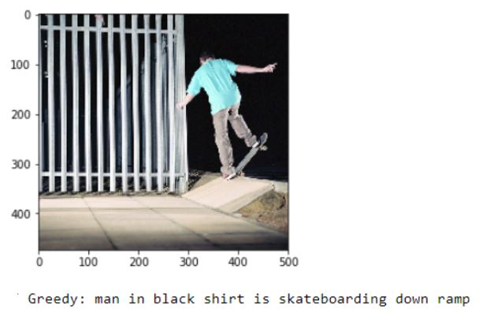
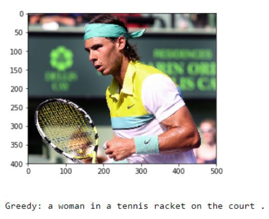

# Image-Captioning-AI-Project
## An automated image caption generator built using the Flickr-8k dataset
This project implements an Image caption generator using Deep Learning. We use Flickr-8K dataset to train our model. Each image in the dataset comes with 5 manually generated descriptions of the image. For ensuring syntactic correctness, we use GloVe vectors. Our model consists mainly of 2 components: First is CNN based image feature extractor ( we use Inception V3 model for this). Second part is sentence generator, which is RNN based(We use LSTMs for this). We remove the last layer of the Inception V3 model and feed it to the LSTM network along with a dummy start token. End of the generated sequence is marked by a special end token.
_Following are some of the sample results we got from the model._

Some were just spot on!
_Others not quite_



# Packages Needed:
Most of the packages needed to run the project come pre-installed with Anaconda. If you want, you can install the packages using the pip package manager as follows:
```
 pip install numpy
 pip install pandas
 pip install matplotlib
 pip install Keras
```

## How to run the project? 

1> Clone the project in the directory containing the images you want to generate the captions for.

2> In the AI_Assignment.py file, change the test directory to the current directory.

If you liked this project please spare some time filling out this feedback form:
https://docs.google.com/forms/d/e/1FAIpQLSeWyH0VszyVXmhGIPSgZPmX720dqeciMHPLBP5ym4ihJtPY3w/viewform?usp=sf_link
